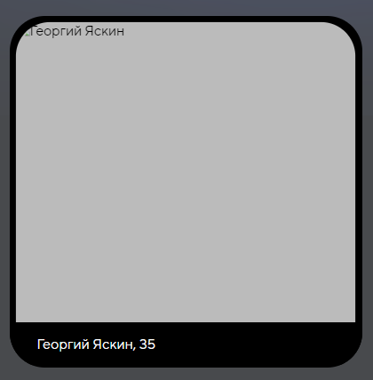
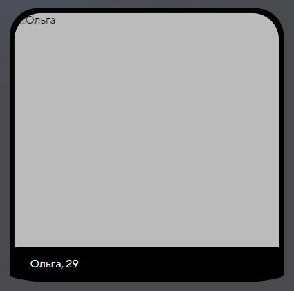

# Домашние задание №1 по курсу "Обеспечение качества в разработке ПО"

### Исполнители:
- Толкачев Родион
- Долматов Федор
- Атрошко Никита

## Регистрация и авторизация

- **Авторизация**:  
  - При корректно введенных данных осуществляется вход в систему, если какое-либо поле не заполнено, отображается соответствующее сообщение. ✅
  - При ошибке авторизации отображается соответствующее сообщение. ✅
  - Кнопка **Показать/скрыть пароль** работает. ✅
  - При нажатии кнопки "Регистрация" пользователь переходит на страницу регистрации. ✅
  - При нажатии кнопки назад пользователь переходит на предыдущую страницу. ✅

- **Регистрация**:  
  - На каждом этапе происходит валидация введенных полей, отображаются соответсвующие ошибки с подсказками, если ошибок нет, при нажатии кнопки продолжить осуществляется переход на следующий шаг. ✅
  - **Показать/скрыть пароль** работает. ✅
  - При нажатии кнопки "Войти" пользователь переходит на страницу авторизации. ✅
  - Кнопки "Назад" и "Продолжить" переходят между этапами (на первом этапе кнопка "Назад" возвращает на предыдущую страницу). ✅
  - Форма регистрации хранит введенные данные между шагами (заново вводить данные при нажатии кнопок "Назад"/"Продолжить" не требуется). ✅
  - При нажатии кнопки "Завершить" регистрация завершается с автоматической авторизацией. ✅
  - При уже зарегистрированном логине выводится сообщение об ошибке, регистрации не происходит.✅

## Страница настроек пользователя

- **Навигация в настройках**:  
  - Работает корректно, вкладки переключаются при нажатии. ✅

- **Вкладка "Профиль"**:
  - **Фотографии**:  
    - При добавлении фотография не загружается, сообщения об ошибке нет. ⚠️
    > **[Баг]**
    > 
    > Ожидается: фотография загружается, при ошибке выводится сообщение.
    - При удалении фотография не удаляется, сообщения об ошибке нет. ⚠️
    > **[Баг]**
    > 
    > Ожидается: фотография удаляется, при ошибке выводится сообщение.
  - **Интересы**:  
    - Редактирование работает, обновление интересов корректно. ✅
    - Если интересы не выбраны, отображается ошибка. ✅
  - **Биография**:
    - Редактирование работает, проверка корректности с подсказками.  ✅
    - Обновление происходит, если нет ошибок, иначе выводится сообщение об ошибке. ✅

- **Вкладка "Безопасность"**:
  - **Редактирование имени**:  
    - При заполнении полей как и при регистрации происходит проверка корректности, при ошибке отображается соответсвующее сообщение + подсказка.  ✅
    - Обновление происходит только при отсутствии ошибок. ✅
  - **Редактирование почты**:  
    - Аналогично редактированию имени. ✅
    - Выполняется проверка текущего пароля для смены почты, если пароль неверный отображается соответсвующее сообщение. ✅
  - **Редактирование пароля**:  
    - Аналогично редактированию имени. ✅
    - Выполняется проверка текущего пароля для установки нового, если пароль неверный отображается соответсвующее сообщение. ✅

- **Вкладка "Подписка"**:
  - Статус подписки не меняется после истечения срока действия подписки. ⚠️
    > **[Баг]**
    > 
    > Ожидается: статус подписки должен обновляться после истечения срока подписки.
  - **Оформление подписки**:  
    - При нажатии кнопки "Оформить подписку" открывается модальное окно с инструкцией и кнопкой "Продолжить" для перехода в платежную систему. ✅
    - При нажатии на кнопку продолжить пользователь переходит в платежную систему. После оплаты пользователь возвращается на страницу настроек (вкладка "Подписка") ✅
    - После оплаты статус подписки обновляется, но история платежей не обновляется. ⚠️
    > **[Баг]**
    > 
    > Ожидается: история платежей должна обновляться сразу после оплаты.

- **Кнопка "Выход"**:  
  - При нажатии на кнопку открывается модальное окно с подтверждением, при нажатии кнопки "Продолжить" происходит выход из системы. ✅
  - Если действие авторизационной cookie закончилось, то автоматический выход из системы не происходит, а при нажатии "Продолжить" появляется ошибка "что-то пошло не так". ⚠️
    > **[Баг]**
    > 
    > Ожидается: автоматический выход из системы при завершении действия авторизационной cookie.
## Лента с выбором карточек
- При нажатии на зеленую кнопку с галочкой происходит лайк, и карточка улетает вправо ✅
- При нажатии на красную кнопку с крестиком происходит дизлайк, и карточка улетает влево ✅
- При нажатии на кнопку по середине появляется модальное окно с возможностью пожаловаться на данного пользователя
  - При нажатии на предложенные причины жалоб они выделяются зеленым ✅
  - При выборе причины и нажатии на кнопку Пожаловаться появляется небольшое уведомление на 1 секунду, что жалоба отправлена ✅
  - При отправке жалобы без выбора причины приходит оповещение, что что-то не так, а с сервера приходит ошибка 500 ❌
    > **[Баг]**
    > 
    > Ожидаемый результат: появление предупреждения, что причина не выбрана и просьба выбрать причину
  - При нажатии кнопки Отмена модальное окно закрывается ✅
  - При нажатии области вне модального окна модальное окно закрывается ✅
- Если пользователь добавил больше одной фотографии, то есть возможность пролистать его фотографии ✅
- При листании фотографий в карточке отправляется запрос на дизлайк ❌
    > **[Баг]**
    > 
    > Ожидаемый результат: никаких лишних запросов
- Для мобильных устройств и планшетов ненужный запрос на дизлайк происходит при нажатии на карточку для информации про пользователя и повторном нажатии, чтобы вернуться к просмотру изображений ❌
    > **[Баг]**
    > 
    > Ожидаемый результат: никаких лишних запросов
## Страница с мэтчами пользователя
- При вводе в инпут поиска происходит поиск по имени человека ✅
- При фильтрации пользователей если пришло 4 пользователя появляется большой отсуп между линиями ❌
    > **[Баг]**
    > 
    > Ожидаемый результат: обычный отступ как и при полностью заполненной сетке
- При наведении на карточки пользователя появляется шкала внизу с именем и возрастом человека
- При наведении на некоторых пользователей шкала снизу вылазиет из формы карточки ❌
    > **[Баг]**
    > 
    > Ожидаемый результат:
    > 
    > 
    > 
    > Фактический результат:
    > 
    > 
- При нажатии на карточку пользователя появляется модальное окно с расширенной информации о человеке, кнопки для перехода в чат с пользователем и кнопки для закрытия модального окна
  - При нажатии на кнопку происходит переход на страницу с чатом с выбранным пользователем ✅
  - При нажатии на кнопку закрытия происходит закрытие модального окна ✅
  - При нажатии на область вне модального окна происходит закрытие модального окна ✅  
## Страница с чатами
- При нажатии на кнопку с чатом открывается чат с пользователем ✅
- При нажатии на кнопку назад или ничего не происходит или происходит переадресация на предыдущую страницу ❌
    > **[Баг]**
    > 
    > Ожидаемый результат: нажатие на кнопку назад возвращает на страницу карточек
- При нажатии кнопки кнопки отправки сообщения или клавиши enter отправляется сообщение ✅
- По прошествии ~5 минут сообщения перестают отправляться ❌
    > **[Баг]**
    > 
    > Ожидаемый результат: сообщения всегда отправляются
- Время отправки последнего сообщения отображается с орфографической ошибкой ❌
    > **[Баг]**
    >
    > Ожидаемый результат: правильное падежное окончание слова в зависимости от времени
    >
    > Фактический результат: 
    >
    > 
- В пустом чате с пользователем появляется информационное окно о том, что пока нет сообщений ✅
- Если сообщение пустое, при нажатии на кнопку отправки ничего не происходит ✅
