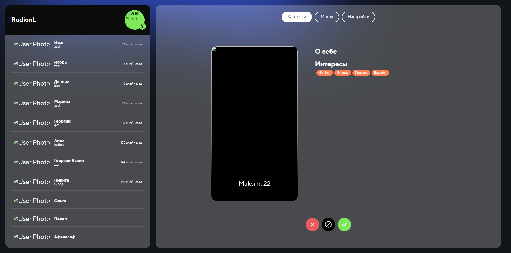

# Домашние задание №1 по курсу "Обеспечение качества в разработке ПО"

Окружение, выбранное для тестирования - Google Chrome Версия 128.0.6613.138.

Ссылка на сайт: [Jimder](https://jimder.ru).

### Исполнители:

- Толкачев Родион
- Долматов Федор
- Атрошко Никита

## [Страница настроек пользователя (ссылка)](https://jimder.ru/profile)

- При загрузке страницы настроек изначально отображается вкладка "Профиль", где отображаются настройки фото, интересов и биографии. ✅

  > 

- **Навигация в настройках**:

  - При нажатии кнопки "Профиль" пользователь переходит во вкладку "Профиль", где отображаются настройки фото, интересов и биографии. ✅

    > 

  - При нажатии кнопки "Безопасность" пользователь переходит во вкладку "Безопасность", где отображаются настройки почты, пароля и имени; кнопка удаления аккаунта ✅

    > 

  - При нажатии кнопки "Подписка" пользователь переходит во вкладку Подписка, где отображаются статус подписки, история платежей, кнопка оформления подписки ✅

    > 

  - **Кнопка "Выход"**:
    - При нажатии на кнопку "Выход" открывается модальное окно с подтверждением ✅
    - При нажатии кнопки "Продолжить" происходит выход из системы. ✅
    - При кнопки нажатии "Продолжить" выхода из системы не происходит.❌
      > **[Баг]**
      >
      > 

- **Вкладка "Профиль"**:

  - **Фотографии**:
    - При добавлении, фотография загружается. ✅
    - При успешной загрузке фотография автоматически отображается в навбаре. ✅
    - При добавлении, фотография не загружается, сообщения об ошибке нет. ❌
      > **[Баг]**
      >
      > 
      >
      > Ожидается: фотография загружается, при ошибке выводится сообщение.
    - При удалении, фотография удаляется. ✅
    - При успешном удалении фотография автоматически меняется на стандартную в навбаре. ✅
    - При удалении фотография не удаляется, сообщения об ошибке нет. (поведение аналогично загрузке изображения) ❌
      > **[Баг]**
      >
      > Ожидается: фотография удаляется, при ошибке выводится сообщение.
  - **Интересы**:

    Скринкаст редактирования интересов:

    > 

    - При нажатии кнопки редактировать (иконка карандаша) открывается модальное окно с выбором интересов. ✅
    - При нажатии кнопки "Сохранить" происходит обновление интересов, при отсутствии ошибок. ✅
    - Если интересы не выбраны, отображается ошибка ("Выберите хотя бы один интерес"). ✅
      - Эта ошибка автоматически скрывается, если выбран хотя бы один интерес. ✅
    - Если при нажатии кнопки "Сохранить" произошла ошибка на стороне сервера, отображается сообщение "Что-то пошло не так". ✅

  - **Биография**:

    Скринкаст редактирования биографии:

    > 

    - При нажатии кнопки редактировать (иконка карандаша) открывается модальное окно с текстовым полем для изменения биографии. ✅
    - При нажатии кнопки "Сохранить" происходит обновление биографии, при отсутствии ошибок. ✅
    - Если поле **Ваше Био** пустое при вводе, то отображается ошибка ("Поле не может быть пустым") ✅
      - Эта ошибка автоматически скрывается, если поле не пустое. ✅
    - Если поле **Ваше био** пустое при нажатии кнопки "Сохранить", то отображается ошибка ("Поле не может быть пустым") ✅
      - Эта ошибка автоматически скрывается, если поле не пустое. ✅
    - Если при нажатии кнопки "Сохранить" произошла ошибка на стороне сервера, отображается сообщение "Что-то пошло не так". ✅
    - Если ошибок нет, то при нажатии кнопки "Сохранить", биография меняется на новую. ✅

- **Вкладка "Безопасность"**:

  - **Редактирование имени**:

    - При нажатии кнопки редактировать открывается модальное окно с полем для ввода данных. ✅
    - Если поле **Ваше имя** пустое при вводе, то отображается ошибка ("Поле не может быть пустым") ✅
      - Эта ошибка автоматически скрывается, если поле не пустое. ✅
    - Если поле **Ваше имя** пустое при нажатии кнопки "Сохранить", то отображается ошибка ("Поле не может быть пустым") ✅
      - Эта ошибка автоматически скрывается, если поле не пустое. ✅
    - Если поле **Ваше имя** не проходит валидацию

      > (2-32 символа английского/русского алфавита, разделяемые дефисом/пробелом (не может начинаться с дефиса или пробела))

      при вводе, то отображается ошибка "Поле некорректно" и подсказка. ✅

      - Подсказка и ошибка автоматически скрываются, если валидация проходит. ✅

    - Если поле **Ваше имя** не проходит валидацию

      > (2-32 символа английского/русского алфавита, разделяемые дефисом/пробелом (не может начинаться с дефиса или пробела))

      при нажатии кнопки "Сохранить", то отображается ошибка "Поле некорректно" и подсказка. ✅

      - Подсказка и ошибка автоматически скрываются, если валидация проходит. ✅

    - Если при нажатии кнопки "Сохранить" произошла ошибка на стороне сервера, отображается сообщение "Что-то пошло не так". ✅
    - Если ошибок нет, то при нажатии кнопки "Сохранить", имя меняется на новое. ✅
    - При успешной смене имени оно сразу меняется и в навбаре без перезагрузки страницы. ✅

  - **Редактирование почты**:

    - При нажатии кнопки редактировать открывается модальное окно с полями для ввода данных. ✅
    - Если поле **Новый email** пустое при вводе, то отображается ошибка ("Поле не может быть пустым") ✅
      - Эта ошибка автоматически скрывается, если поле не пустое. ✅
    - Если поле **Новый email** пустое при нажатии кнопки "Сохранить", то отображается ошибка ("Поле не может быть пустым") ✅
      - Эта ошибка автоматически скрывается, если поле не пустое. ✅
    - Если поле **Новый email** не проходит

      > (латинские символы ASCII printable, формат email, максимальная длина 320 символов)

      при нажатии кнопки "Сохранить", то отображается ошибка "Поле некорректно" и подсказка.

      - Подсказка и ошибка автоматически скрываются, если валидация проходит. ✅

    - Если поле **Новый email** не проходит валидацию

      > (латинские символы ASCII printable, формат email, максимальная длина 320 символов)

      при вводе, то отображается ошибка "Поле некорректно" и подсказка.

      - Подсказка и ошибка автоматически скрываются, если валидация проходит. ✅

    - Если поле **Текущий пароль** пустое при вводе, то отображается ошибка ("Поле не может быть пустым") ✅
      - Эта ошибка автоматически скрывается, если поле не пустое. ✅
    - Если поле **Текущий пароль** пустое при нажатии кнопки "Сохранить", то отображается ошибка ("Поле не может быть пустым") ✅
      - Эта ошибка автоматически скрывается, если поле не пустое. ✅
    - Выполняется проверка текущего пароля для смены почты, если пароль неверный отображается соответсвующее сообщение. ("Что-то пошло не так") ✅
    - Если при нажатии кнопки "Сохранить" произошла ошибка на стороне сервера, отображается сообщение "Что-то пошло не так". ✅
    - Если ошибок нет, то при нажатии кнопки "Сохранить", email меняется на новый. ✅

  - **Редактирование пароля**:

    - При нажатии кнопки редактировать открывается модальное окно с полями для ввода данных. ✅
    - Если поле **Текущий пароль** пустое при вводе, то отображается ошибка ("Поле не может быть пустым") ✅
      - Эта ошибка автоматически скрывается, если поле не пустое. ✅
    - Если поле **Текущий пароль** пустое при нажатии кнопки "Сохранить", то отображается ошибка ("Поле не может быть пустым") ✅
      - Эта ошибка автоматически скрывается, если поле не пустое. ✅
    - Если поле **Новый пароль** пустое при вводе, то отображается ошибка ("Поле не может быть пустым") ✅
      - Эта ошибка автоматически скрывается, если поле не пустое. ✅
    - Если поле **Новый пароль** пустое при нажатии кнопки "Сохранить", то отображается ошибка ("Поле не может быть пустым") ✅
      - Эта ошибка автоматически скрывается, если поле не пустое. ✅
    - Если поле **Новый пароль** не проходит валидацию

      > (длина пароля 8-32 символа, только ASCII printable символы)

      при нажатии кнопки "Сохранить", то отображается ошибка "Поле некорректно" и подсказка. ✅

      - Подсказка и ошибка автоматически скрываются, если валидация проходит. ✅

    - Если поле **Новый пароль** не проходит валидацию

      > (длина пароля 8-32 символа, только ASCII printable символы)

      при вводе, то отображается ошибка "Поле некорректно" и подсказка. ✅

      - Подсказка и ошибка автоматически скрываются, если валидация проходит. ✅

    - Выполняется проверка текущего пароля для установки нового, если пароль неверный отображается соответсвующее сообщение. ("Что-то пошло не так"). ✅
    - Если при нажатии кнопки "Сохранить" произошла ошибка на стороне сервера, отображается сообщение "Что-то пошло не так". ✅
    - Если ошибок нет, то при нажатии кнопки "Сохранить", пароль меняется на новый. ✅

  - **Кнопка "Удалить аккаунт"**:
    - При нажатии кнопки открывается модальное окно для подтверждения. ✅
    - При нажатии кнопки "Продолжить" аккаунт пользователя удаляется. ✅
    - Если при нажатии кнопки "Продолжить" произошла ошибка на стороне сервера, отображается сообщение "Что-то пошло не так". ✅

- **Вкладка "Подписка"**:
  - Отображается текущий статус подписки. ✅
  - Отображается история платежей. ✅
  - Статус подписки меняется после истечения срока действия подписки. ✅
  - Статус подписки не меняется после истечения срока действия подписки. ❌
    > **[Баг]**
    >
    > 
    >
    > Ожидается: статус подписки должен обновляться после истечения срока подписки.
  - **Оформление подписки**:
    - При нажатии кнопки "Оформить подписку" открывается модальное окно с инструкцией и кнопкой "Продолжить" для перехода в платежную систему. ✅
    - При нажатии на кнопку продолжить пользователь переходит в платежную систему. После оплаты пользователь возвращается на страницу настроек (вкладка "Подписка") ✅
    - После оплаты статус подписки обновляется. ✅
    - После оплаты история платежей обновляется. ✅
    - После оплаты история платежей не обновляется. ❌
      > **[Баг]**
      >
      > 
      >
      > Ожидается: история платежей должна обновляться сразу после оплаты.
      >
      > 

## Лента с выбором карточек

- При нажатии на зеленую кнопку с галочкой происходит лайк, и карточка улетает вправо ✅
- При нажатии на красную кнопку с крестиком происходит дизлайк, и карточка улетает влево ✅
- При нажатии на кнопку по середине появляется модальное окно с возможностью пожаловаться на данного пользователя
  - При нажатии на предложенные причины жалоб они выделяются зеленым ✅
  - При выборе причины и нажатии на кнопку Пожаловаться появляется небольшое уведомление на 1 секунду, что жалоба отправлена ✅
  - При отправке жалобы без выбора причины приходит оповещение, что что-то не так, а с сервера приходит ошибка 500 ❌
    > **[Баг]**
    >
    > Ожидаемый результат: появление предупреждения, что причина не выбрана и просьба выбрать причину
  - При нажатии кнопки Отмена модальное окно закрывается ✅
  - При нажатии области вне модального окна модальное окно закрывается ✅
- Если пользователь добавил больше одной фотографии, то есть возможность пролистать его фотографии ✅
- При листании фотографий в карточке отправляется запрос на дизлайк ❌
  > **[Баг]**
  >
  > Ожидаемый результат: никаких лишних запросов
- Для мобильных устройств и планшетов ненужный запрос на дизлайк происходит при нажатии на карточку для информации про пользователя и повторном нажатии, чтобы вернуться к просмотру изображений ❌
  > **[Баг]**
  >
  > Ожидаемый результат: никаких лишних запросов

## Страница с мэтчами пользователя

- При вводе в инпут поиска происходит поиск по имени человека ✅
- При фильтрации пользователей если пришло 4 пользователя появляется большой отсуп между линиями ❌
  > **[Баг]**
  >
  > Ожидаемый результат: обычный отступ как и при полностью заполненной сетке
- При наведении на карточки пользователя появляется шкала внизу с именем и возрастом человека
- При наведении на некоторых пользователей шкала снизу вылазиет из формы карточки ❌
  > **[Баг]**
  >
  > Ожидаемый результат:
  >
  > 
  >
  > Фактический результат:
  >
  > 
- При нажатии на карточку пользователя появляется модальное окно с расширенной информации о человеке, кнопки для перехода в чат с пользователем и кнопки для закрытия модального окна
  - При нажатии на кнопку происходит переход на страницу с чатом с выбранным пользователем ✅
  - При нажатии на кнопку закрытия происходит закрытие модального окна ✅
  - При нажатии на область вне модального окна происходит закрытие модального окна ✅

## Страница с чатами

- При нажатии на кнопку назад в окне чата или ничего не происходит или происходит переадресация на предыдущую страницу ❌
  > **[Баг]**
  >
  > Ожидаемый результат: нажатие на кнопку назад возвращает на страницу карточек
- При нажатии кнопки кнопки отправки сообщения или клавиши enter отправляется сообщение ✅
- По прошествии ~5 минут сообщения перестают отправляться ❌
  > **[Баг]**
  >
  > Ожидаемый результат: сообщения всегда отправляются
- В пустом чате с пользователем появляется информационное окно о том, что пока нет сообщений ✅
- Если сообщение пустое, при нажатии на кнопку отправки ничего не происходит ✅

## Тестирование браузерной навигации

Изначально определим какие виды страниц есть: страницы доступные авторизированному пользователю и обычные страницы (гостя)

Страницы доступные авторизированному пользователю:

- [/main](https://jimder.ru/main)
- [/profile](https://jimder.ru/profile)
- [/matches](https://jimder.ru/matches)
- [/chats](https://jimder.ru/chats)

Страницы гостя:

- [/login](https://jimder.ru/login)
- [/register](https://jimder.ru/register)
- [/](https://jimder.ru/)

Если пользователь авторизован:

- при попытке открыть страницу гостя происходит редирект на страницу [/main](https://jimder.ru/main)
- при попытке открыть страницу для авторизованного пользователя открывается страница

Если пользователь неавторизован:

- при попытке открыть страницу гостя она открывается
- при попытке открыть страницу для авторизованного пользователя открывается страница [/login](https://jimder.ru/login)

Расммотрим некоторые частные случаи:

- При выходе из-под учетной записи пользователя перекидывает на стринцу авторизации, если нажать на кнопку Назад, переходим на страницу профиля, но так как пользователь не авторизован ничего не загружается, и просто остается пустой скелет. Но при перезагрузке этой странице мы поподаем на страницу логина ❌
  > **[Баг]**
  >
  > Ожидаемый результат:
  >
  > Оставаться на странице логина
  >
  > Фактический результат:
  >
  > 
- При нажатии на кнопку назад браузера после авторизации и перехода на страницу профиля происходит переход на страницу карточек (ленту). То есть пользователь не возвращается в состояние гостя ✅
- При нажатии на итем чата в навбаре переходим на чат с этим пользователем. При нажатии кнопки Назад пользователь возвращается на страницу, с которой он перешел ✅
- При нахождении на странице мэтчей и открытии матча с пользователем и нажатии на перейти в чат, переходим на чат с этим пользователем. При нажатии кнопки Назад пользователь возвращается на страницу, с которой он перешел ✅

## Тестирование отдельных компонентов

### Навбар

- При нажатии на кнопку с чатом открывается чат с пользователем ✅
- - Время отправки последнего сообщения отображается с орфографической ошибкой ❌
    > **[Баг]**
    >
    > Ожидаемый результат: правильное падежное окончание слова в зависимости от времени
    >
    > Фактический результат:
    >
    > 
- При уменьшении экрана до 896px навбар пропадает, остается только футер ✅

### Хэдер

Хэдер на сайте используется для навигации по сайту и переходу по страницам требующим авторизации, представляет собой кнопки.

При ширине экрана больше 897px хэдер расположен сверху.

При ширине экрана с 540px до 896px хэдер размещается внизу, превращаясь, по факту, футер. Появляются иконки с подписями. Туда также добавляется иконка для перехода на страницу с чатами.

При ширине экрана меньше 540px хэдер подписи пропадают и остаются только иконки. Иконки выдержаны в одном стиле, понятны и соответсвуют страницам для перехода.

